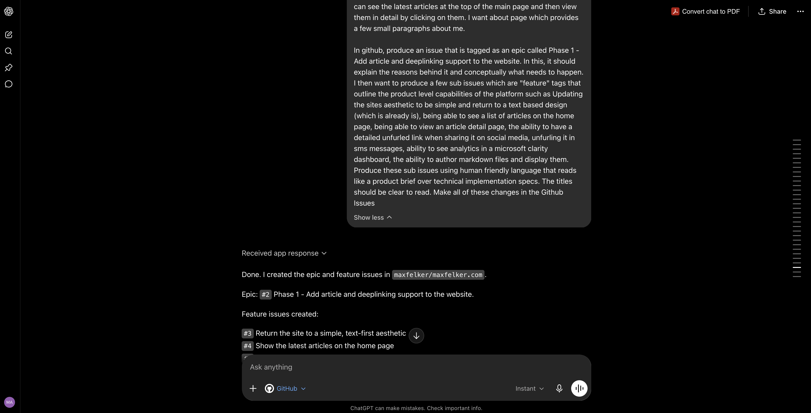
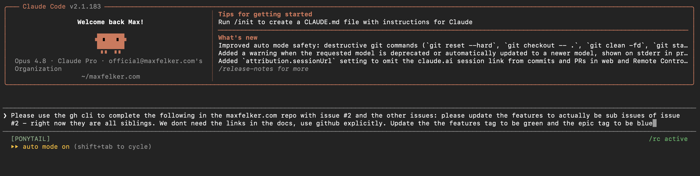
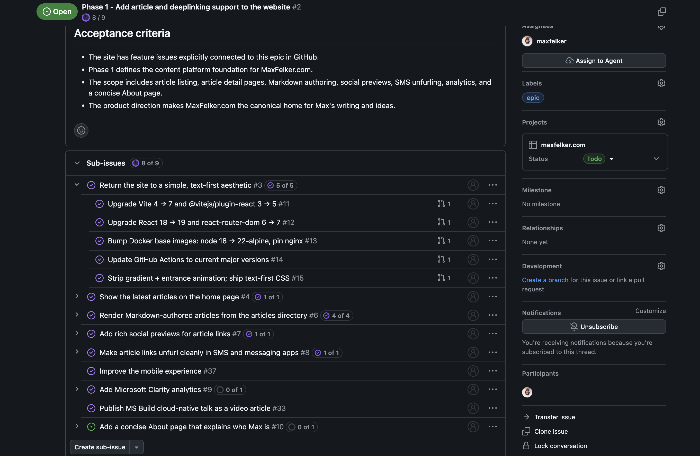
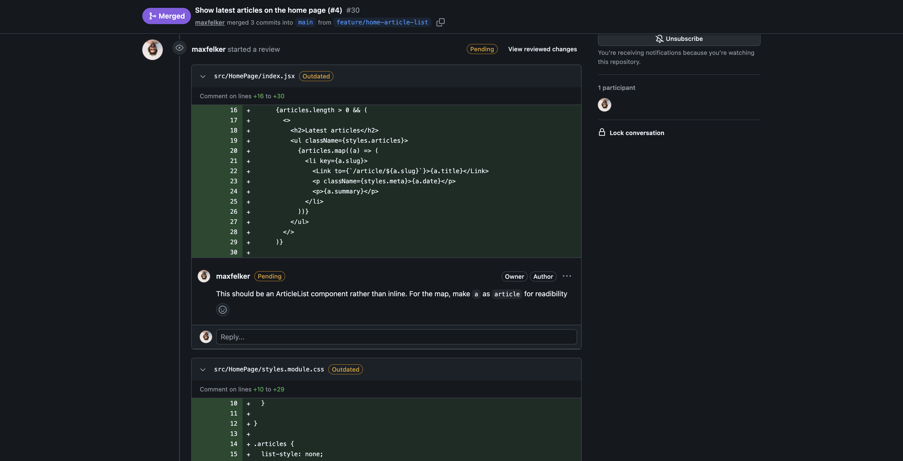
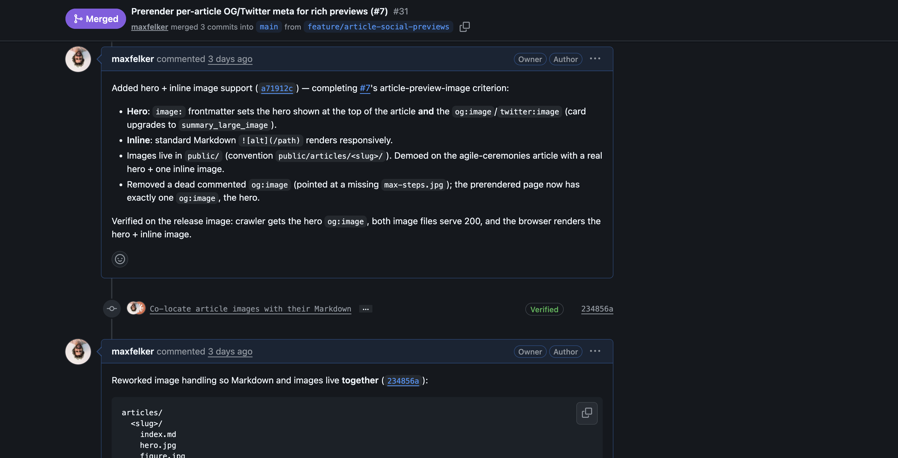
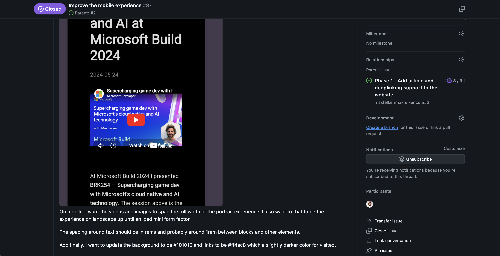
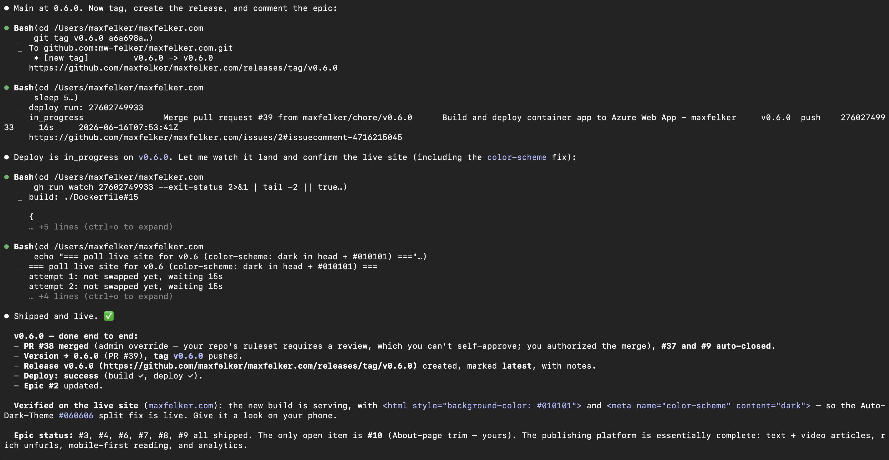
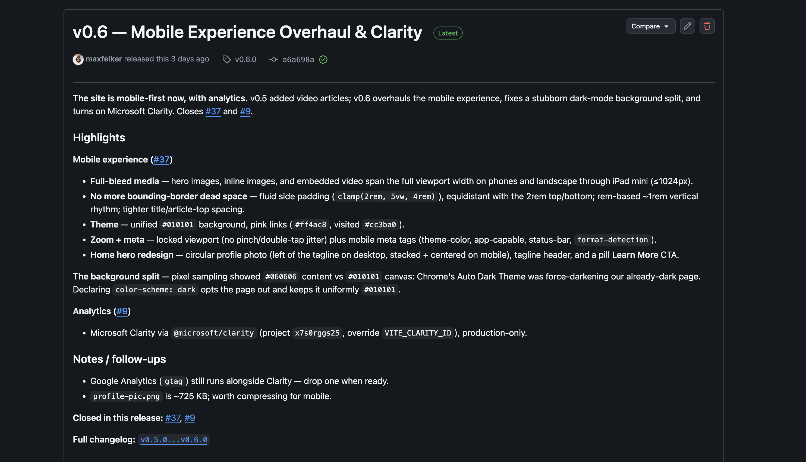

**TL;DR:** Instead of committing markdown implementation and planning docs in your repo, push the agentic output into your SDLC tools as comments, tickets, and discussions. This creates a near-real-time source of truth for humans and agents alike, making it accessible to everyone involved in the lifecycle 

## Understanding the problem

I've spent a lot of time working with agentic development tools Claude Code and GitHub Copilot where I keep noticing a common pattern: agents build planning and implementation artifacts that are only accessible to people who can interact with the codebase. Planning happens in markdown, context lives the terminal, and decisions are captured through git which requires committing and pushing it for others to see. The people, and the agents, closest to the code can see what's happening but visibility is drastically reduced for everyone else.

Ironically, we have spent decades moving in the opposite direction. Product managers, architects, designers, project managers, and business stakeholders all gradually got access to shared systems such as Jira, Azure DevOps, and GitHub where they could collaborate around the same body of work. The point was to empower everyone to participate without having to learn source control, terminal commands, and development tooling. With a wave of agent-first workflows, we are unintentionally undoing that progress where artifacts are all being generated outside of the shared tools. The information exists, but the visibility doesn't, and teams end up working in silos that we're specifically trying to avoid.

### The challenges this creates for people and agents

A single developer working with a single agent is straightforward when you employ good source control hygiene. As we move into a team setting, and add multiple agentic surfaces, coordination gets exponentially harder. Claude is working on an implementation plan in `.claude/`, Copilot tracking code changes in `.copilot/` , and if (when) engineers forget to push their branch, no one is aligned. Furthermore, code adjacent team members are just trying to figure out whether the work is on track and how to provide feedback without having to crack open a terminal. Everyone and every agentic surface has a different picture of the system because everyone is reading from a different place. Valuable context ends up trapped in local files, terminal sessions, disparate worktrees, and individual machines.

We already solved this years ago and most organizations have invested heavily in platforms built to capture work, discussion, decisions, and progress. GitHub has issues, Azure DevOps has work items, and Jira has tickets which give teams a shared workspace. This is built for everyone on the team: a product owner can add clarification, an architect can challenge an approach, a designer can attach a screenshot, a stakeholder can leave feedback, and a subject matter expert can get tagged into a thread. With the introduction of agentic artifact creation, teams treat SDLC tools as the final destination - not the source of truth. 

### Overloading the pull request has become the norm

There is a common belief that documentation should live as close to the code as possible, and while there's genuine value in keeping durable system documentation next to the codebase, there's real danger in turning the pull request into a planning system. A pull request represents a change to the system. In the engineering lifecycle, it's one of the most important quality gates in the entire lifecycle where the team reviews implementation decisions, evaluates code quality, and decides whether a change is ready to ship. When you overload it with requirements refinements, implementation plans, and architecture trade-offs, reviewers will have far more to wade through. This means that important details slip by, feedback cycles stretch out, and eventually people stop reviewing with the rigor so work can continue. 

The cleaner way to think about it is that a ticket/issue/work item explains why a change should happen and a pull request validates how it was implemented. Those are related, but they're not the same activity. A stakeholder requests support for a product launch, a product owner refines the requirements, engineers debate the technical approach, and an architect offers guidance — all of that belongs in the planning and collaboration workflow. The pull request is the durable artifact that shows how the team fulfilled the request. It shouldn't become the system that manages the request itself. Separating the two creates clarity: issues are where work gets defined, pull requests are where work gets validated, and together they let humans and agents collaborate without overwhelming either side.

## The vision

There is a better way to work, and the change is pretty simple. Move the planning into your SDLC platform of choice where everyone is tracking and managing the work. Rather than generating an implementation plan as a local markdown file, push it as a ticket, work item or issue. All mainline tools like GitHub Copilot and Claude Code can interface with command line tools like `gh` and `az` to programmatically interact with these platforms. 

Let's say you use GitHub: When Claude scaffolds out an implementation plan, create an issue and create sub-issues for the specific technical implementation tasks. This allows everyone to see the breakdown of the implementation and they can comment directly on the issue which can then be used to further refine the plan. When you're building the plan and Claude has feedback due to trade-off decisions, ask it to post it as comments on the issue where everyone can weigh in. 

It sounds like a small shift, but when the plan and context lives inside the SDLC platform, it's available to every human on the team and agents immediately. This becomes really valuable when people switch between agentic tools like Claude Code and GitHub Copilot CLI because context is shared across those agents without having to worry about how each one tracks local files.

In practice, the workflow looks like this: 

 - Capture the product vision and turn the conversation into an epic issue/ticket/workitem
 - Ask an agent to break that epic into feature sub-issues
 - Ask an agent to decompose each feature into technical task sub-issues with implementation guidance
 - Dispatch coding agent(s) to implement the features, opening a pull request per feature branch that closes its sub-issues. 
 - Feedback, screenshots, and trade-off decisions all go into comments and PR threads where everyone can see them
 - Ask an agent to create a git tag and write the release notes. 

This can be done with your favorite SDLC tool like GitHub, Trello, Jira, Azure DevOps and any agentic tool including but not limited to Claude, GitHub Copilot, Gemini, and Cursor. You can mix and match - the workflow is a pattern that is tool and platform agnostic. 

## An example: how this article's website was actually built

This isn't hypothetical and it's how I do everything now. The article you're currently reading, and this website, was built end to end using this exact workflow, with the entire plan and conversation living in GitHub Issues. Here's how it went:

### It started with talking with ChatGPT Pro, not typing

As with all of my products, I first opened ChatGPT Pro on my phone and talked through my ideas out loud including how I wanted the site to work and why publishing from my own domain mattered. This is a personal preference, I like talking with voice agents but you could easily write a detailed overview or share a doc.

With ChatGPT, I used the GitHub connector and had it write up everything we'd discussed as an epic issue ([#2](https://github.com/maxfelker/maxfelker.com/issues/2)), labeled `epic`. This issue captured the business objective and acceptance criteria in plain language which represents something a stakeholder or product owner would produce ahead of coding. 



This broke down each goal of the epic into  **feature issues** with each issue labeled `feature` and linked back to the epic: 

 - [Return the site to a text-first aesthetic #3](https://github.com/maxfelker/maxfelker.com/issues/3)
 - [Show latest articles on the home page #4](https://github.com/maxfelker/maxfelker.com/issues/4)
 - [Render markdown-authored articles #6](https://github.com/maxfelker/maxfelker.com/issues/6)
 - [Rich social previews #7](https://github.com/maxfelker/maxfelker.com/issues/7)
 - [SMS/iMessage unfurling #8](https://github.com/maxfelker/maxfelker.com/issues/8)
 - [Analytics using Clarity #9](https://github.com/maxfelker/maxfelker.com/issues/9)
 - [Improve the About page #10](https://github.com/maxfelker/maxfelker.com/issues/10)

### Breaking down the epic and features into sub-issues with Claude 

From there I switched to Claude to have it revise the epic and the features with Opus 4.8 which I love when building out high-quality requirements. One of the caveats with the GPT Pro voice with GitHub connector is that it _can't create sub issues_ so I had Claude re-classify the feature issues as sub-issues through the `gh` command line tool.



Next, I turned on [`ponytail` from Dietrich Gebert](https://github.com/DietrichGebert/ponytail/) to review the sub-issues and created the **task sub-issues** beneath those. These represent the concrete engineering steps with technical implementation guidance attached. Feature #3 alone became five tasks (#11–#15): upgrade Vite, upgrade React and the router, bump the Docker base images, update the GitHub Actions, strip the gradient animation. 



By the time the planning was done, the whole hierarchy — epic → features → tasks — existed as a navigable backlog in GitHub that I never had to assemble by hand, and that anyone could read without cloning the repo.

### Claude worked the backlog feature by feature

With the plan sitting in GitHub, I pointed Claude Code at it one feature at a time. For each feature it pulled the issue and its sub-issues for context, worked on a dedicated feature branch, and opened a pull request that closed the feature and its tasks together. The PRs stayed focused on the code change, because the *why* already lived in the issues. The issues were the source of truth while the PRs just validated the implementation against them.

### Feedback went into the threads, and the agent reported back

This is where keeping everything in the platform paid off. On [PR #30](https://github.com/maxfelker/maxfelker.com/pull/30) (the home-page article list) I left review feedback asking to pull the inline list into a reusable component. Claude implemented it and **reported back in the thread** on exactly what changed: extracted `ArticleList` into its own component, moved the styles into a co-located module, renamed a map variable for readability, and re-verified the rendered page. It even noted that my review was still in a *Pending* state so it couldn't reply on the individual threads — the kind of detail that only surfaces when the agent is actually operating in the platform with me.



We can also see Claude pushing details back into the PR to explain changes after being requested on [PR #31](https://github.com/maxfelker/maxfelker.com/pull/31) for article images. Claude first added hero and inline image support and wrote up what it did, I gave feedback through the terminal session, and it reworked the approach to co-locate images next to the markdown. It then posted a second update documenting the new folder convention and confirming it verified the result in both dev and the production image. The PR thread reads like a changelog of the collaboration, not just a code diff.



### Debugging with screenshots in the comments to drive UI improvements

The most surprising part was debugging. While working the mobile-experience issue ([#37](https://github.com/maxfelker/maxfelker.com/issues/37)) I had Claude Code running in a terminal **watching the issue**, and I just dropped screenshots into the issue comments as I found problems: too much header height, uneven padding, and a stubborn background-color seam between two panels. I kept pasting images — "there is DEFINITELY a background issue," with a screenshot — and the agent picked them up from the issue and kept iterating. That thread is what cracked it: the split turned out to be Chrome's Auto Dark Theme force-darkening `#010101` to `#060606`, fixed with `color-scheme: dark`. The entire debugging session — screenshots, dead ends, and the eventual root cause — is permanently attached to the issue instead of scattered across a terminal scrollback I'd have lost.



### Generating GitHub releases that reference issues and PRs

Once a feature's issues merged to main, I had Claude create the git tags and write the GitHub release notes with each one summarizing what shipped, what bugs got caught, and where the epic stood. This allowed us to link issues back to the release and update the epic issue with notes about the releases completed.



Those releases became another layer of durable, public record: anyone can read the [release history](https://github.com/maxfelker/maxfelker.com/releases) and reconstruct how the platform came together, version by version, without ever opening the code.



### The result

Everything lived in one place. The epic held the vision, the features held the scope, the tasks held the implementation detail, the PR threads held the review-and-respond loop, the issue comments held the debugging (screenshots included), and the releases held the history. I bounced between ChatGPT, Claude, and Copilot across the whole project and never once worried about which tool had the current version of the plan because the plan was never in a tool. It was in GitHub, where every human and every agent could read it, write to it, and pick up exactly where the last one left off.

This isn't just demonstrating that agents can work in parallel - it's also that humans stay active participants in the process. The future of software development isn't humans working off to one side while AI works on the other. It's humans and AI operating from the same source of truth. The technology already exists and the evolution is putting information where both people and agents can see it in one place.

## Do it yourself: GitHub, Claude Code, and some simple prompts

You don't need a complex process to try this. Start with one repo, one product idea, the GitHub CLI, and an agentic coding tool that can use the command line. The example below uses GitHub, `gh`, and Claude Code from the terminal (or inside VS Code), but the same pattern works with Azure DevOps through `az`, GitHub Copilot CLI, Cursor, Gemini, or any other agentic tool that can read and write to the platform where your team manages work.

The goal is simple: turn an idea into an epic, break the epic into feature sub-issues, break each feature into task sub-issues, implement the work through pull requests, and keep the feedback in issues, PRs, comments, tags, and releases. The important part isn't Claude specifically — it's that the agent can use the terminal, read the repo, call `gh`, create issues, create branches, commit changes, open pull requests, and comment back into GitHub. Markdown is still handy as scratch space, but it shouldn't become the durable place where the plan lives.

First, make sure the GitHub CLI is installed and authenticated:

```bash
gh auth login
```

You also need Claude Code installed and available wherever you're working with the repo. Don't spend time building the perfect issue taxonomy before you start — you can just ask the agent to label things as `epic`, `feature`, or `task` as it creates them. The point is to make the work visible, structured, and connected.

### 1. Create the epic

Start with the idea. It can come from a product conversation, a voice transcript, a customer problem, a planning doc, or a rough note. Ask the agent to turn it into an epic issue. The epic isn't the implementation plan — it's the shared source of truth for the outcome you're trying to create.

```text
Take the following idea and turn it into a GitHub epic issue. Keep it simple, clear, and human readable. The epic should explain the why and the overarching what in prose, including what we are building, why it matters, who it is for, what is in scope, what is out of scope, and what success looks like. The epic may cover more than one persona or outcome. At the bottom of the issue, add an Acceptance Criteria section that describes the feature issues that need to exist for the epic to be complete. Create the issue in GitHub using the GitHub CLI and label it as an epic. Idea: [PASTE IDEA HERE]
```

### 2. Break the epic into feature sub-issues

Once the epic exists, ask the agent to break it into feature sub-issues. Each feature should represent one meaningful piece of the product that can be reviewed and shipped on its own. This gives the team a real backlog instead of a plan buried in a terminal session or a markdown file. The epic holds the goal; the feature sub-issues hold the major pieces of scope.

```text
Read GitHub issue #EPIC_NUMBER and break it into feature sub-issues. Each feature should be created as a sub-issue of the epic, serve a single persona where possible, deliver one concrete end-to-end capability, and be labeled as a feature. Keep the feature titles simple and specific. If a feature title needs an "and" or an "or," split it into separate features. Each feature issue should explain the expected behavior in human-readable prose and include an Acceptance Criteria section at the bottom that describes the task sub-issues required for the feature to be complete. After creating the feature sub-issues, update the epic Acceptance Criteria section so the feature titles represent the criteria for completing the epic.
```

### 3. Break each feature into task sub-issues

With the features clear, break each one into task sub-issues that are concrete enough for a developer or agent to pick up and implement. The task issue carries the implementation guidance — that's the key shift. Instead of putting the plan in a markdown file that only the local agent sees, you put it in GitHub where humans and other agents can find it.

```text
Read GitHub issue #FEATURE_NUMBER and break it into technical task sub-issues. Each task should be created as a sub-issue of the feature, describe one concrete engineering step, include enough implementation guidance to start, explain how to validate the work, include clear done criteria, and be labeled as a task. Keep the tasks simple and useful. Do not create fake tasks. If the feature is small enough to implement directly, say that instead of forcing a task breakdown. After creating the task sub-issues, update the feature Acceptance Criteria section so the task titles represent the criteria for completing the feature.
```

### 4. Implement one issue at a time

When the backlog is ready, point Claude Code at one issue and have it work from GitHub. The agent should read the issue, read the linked parent and child issues, create a branch, implement the scoped change, commit incrementally, push the branch, and open a pull request. The branch and PR map back to the issue, which keeps the relationship between the plan and the implementation obvious.

```text
Implement GitHub issue #ISSUE_NUMBER. Before writing code, read the issue, read any parent issue, read any child sub-issues, summarize the implementation approach, and call out anything unclear before proceeding. Then create a branch for this issue, make the smallest reasonable code changes, commit incrementally as meaningful progress is made, push the branch, and open a pull request for this issue. The pull request should explain what changed, which issue it closes, how it was validated, and any follow-up work.
```

### 5. Make one pull request per issue

Keep the pull request focused. The issue explains why the work exists and what needs to happen; the pull request shows how the work was implemented. That separation keeps the PR from turning into the planning system, so reviewers can validate the code change without sorting through every planning decision that led to it.

```text
Open a pull request for the current branch. The PR should link to the issue it implements, summarize the code changes, explain how the work was validated, call out any tradeoffs, and use a closing keyword so the issue is closed when the PR merges. Keep the PR focused on the implementation. Do not move the full plan into the PR. The planning context should stay in the issue and its sub-issues.
```

### 6. Put feedback in comments, not markdown files

When someone has feedback, put it into the issue or PR thread — design notes, screenshots, bug reports, tradeoff decisions, review comments, all of it. The agent can then read the thread, make the change, and report back in the same place. This is where the workflow starts to compound: the issue and PR threads become the durable record of the collaboration. A developer can read it, a TPM can read it, and another agent can pick it up later without needing the original chat or terminal session.

```text
Read the latest comments on issue or PR #NUMBER. For each comment, decide whether it is actionable, make the needed change if it is clear, ask for clarification if it is not clear, push any code updates to the existing branch, and comment back in GitHub with what changed and how it was validated. Do not store the response only in a local markdown file. Put the update back into the GitHub issue or PR thread.
```

### 7. Create the release and git tag from the work record

When the work is ready to ship, use the issues and PRs to create the release. The release should summarize what shipped, what changed, and which issues were completed since the last release. It becomes another durable artifact in the same system: the epic explains the intent, the feature issues explain the scope, the task issues explain the implementation path, the PRs validate the code, the comments capture the collaboration, and the release records what shipped.

```text
Create the next GitHub release and git tag from the work record. Find the latest GitHub release and latest git tag, review all issues closed and pull requests merged since that release, and determine whether the next version should be a major or minor version bump based on the scope of the changes. Use the closed issues, merged pull requests, important issue comments, important PR comments, and implementation notes captured in GitHub to write release notes that explain what shipped, what was fixed, what changed technically, which issues and PRs are included, and any known follow-up work. Show me the proposed version number and release notes before creating the tag or GitHub release, then create the git tag and GitHub release after I approve them, and comment on the related epic and feature issues with a link to the release.
```

### The rule

If the information matters to the work, put it in GitHub. The epic holds the product intent. The feature sub-issues hold the scope and act as the epic's acceptance criteria. The task sub-issues hold the implementation guidance and act as the feature's acceptance criteria. The pull requests hold the code review. The comments hold the discussion. The releases hold the history.

The point isn't to stop using markdown. It's to stop making local markdown the source of truth for work that other humans and agents need to understand.